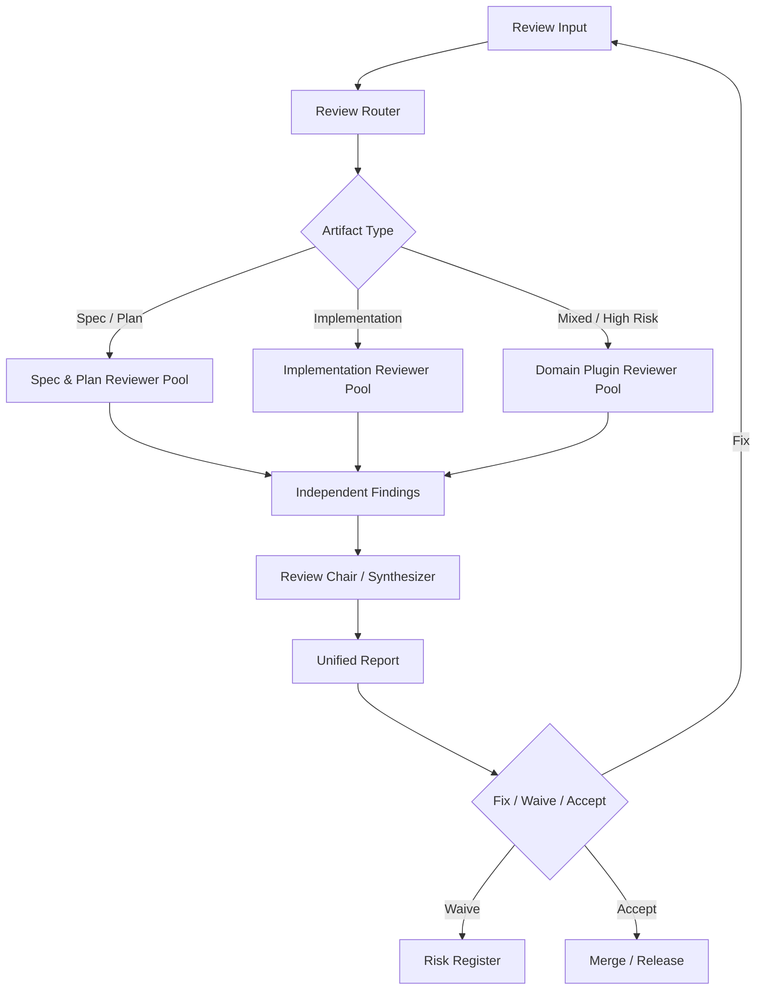

# Reviewer Agent 编排蓝图

本文档从一次“并行审查员”讨论中提炼出一套 reviewer agent 体系。目标不是先制作具体 skill，而是把 reviewer 的类型、性格、能力边界和任务编排方式描述清楚，作为后续 skill 化、agent manifest、路由规则和报告格式的设计基础。

参考讨论：

- ChatGPT share: https://chatgpt.com/share/6a4f8e55-b9b0-83ea-82c2-68d7e9058a78

## 1. 核心判断

Reviewer agent 系统不应该被设计成“一个更强的 code reviewer”。更稳的方向是：

> 用多个盲点不同的 reviewer agent 独立审查同一份材料，再由编排层按风险路由、去重、排序和汇总。

这套系统的价值来自异构视角，而不是多数投票。对于 AI 生成或 AI 辅助生成的代码尤其如此：产出速度提高后，真正的瓶颈会转移到验证端。单个 reviewer 往往会形成固定盲点；多个 reviewer 如果性格、检查面和证据要求不同，就能扩大覆盖面。

因此，reviewer agent 应该围绕风险视角组织，而不是只按技术栈组织。技术栈 reviewer 是必要的，但它们应该作为领域插件接入，而不是取代需求、验收、正确性、安全和测试视角。

## 2. 双阶段 Review 对象

整个系统先区分两类 review 对象。

### 2.1 Spec / Plan Review

审查“要做什么”和“准备怎么做”。

主要问题：

- 需求是否清楚、完整、一致
- 验收标准是否可观察、可测试
- 计划是否可执行
- 风险、迁移、回滚和验证方式是否暴露
- 是否存在隐藏前提、边界缺口和非目标缺失

### 2.2 Implementation Review

审查“做出来的东西是否符合前面承诺”。

主要问题：

- 实现是否逐条满足 spec
- plan 中的关键步骤是否完成，偏离是否有解释
- 代码逻辑是否正确
- 测试是否证明了关键行为
- 安全、集成、性能、发布风险是否可接受

这两个阶段必须连成证据链：

```text
需求 -> 验收标准 -> 计划 -> 实现 -> 测试证据 -> 汇总报告
```

如果 reviewer 只看 diff，不看 spec 和 plan，就容易发现局部代码问题，却错过“实现没有满足需求”或“测试没有证明验收条件”的问题。

## 3. 总体架构



系统分为四层：

- 编排层：决定谁来审、如何汇总。
- Spec / Plan 层：审需求、验收、计划和风险。
- Implementation 层：审实现、测试、正确性和维护性。
- 领域插件层：按 Unity、Web、Backend、CLI、CI 等环境补充专业检查。

## 4. 编排层 Reviewer

### 4.1 Review Router

性格：冷静的分诊员。

职责：

- 识别 review 对象类型：spec、plan、implementation、bugfix、refactor、migration、tool script 等。
- 识别环境和技术域：Unity、Web frontend、Backend/API、CLI、CI/CD、文档、配置等。
- 识别风险等级：低、中、高。
- 选择 reviewer 组合。
- 说明派遣理由，避免无脑全量运行。

输入：

- 用户请求
- spec / plan / diff / PR 描述
- 文件路径和变更摘要
- 测试结果
- 历史事故、敏感目录、风险标签

输出示例：

```json
{
  "artifact_type": "implementation",
  "domains": ["backend_api", "web_frontend"],
  "risk": "high",
  "required_reviewers": [
    "spec_compliance",
    "correctness_auditor",
    "security_abuse",
    "integration_contract",
    "test_skeptic",
    "release_ops"
  ],
  "reason": "Touches public API, authorization-sensitive data, and frontend state."
}
```

### 4.2 Review Chair / Synthesizer

性格：克制的会议主持人。

职责：

- 汇总所有 reviewer findings。
- 去重和合并语义相同的问题。
- 标记 blocking、advisory、question、waived。
- 识别 reviewer 之间的冲突。
- 把 findings 转换成作者可执行清单。
- 输出最终报告和风险登记。

它不应该做的事：

- 不替代具体 reviewer 重新审所有代码。
- 不用多数投票自动决定真伪。
- 不把所有建议平铺到最终报告里制造噪声。

输出格式：

```markdown
## Blocking
1. Spec AC-2 要求空输入不发起搜索请求，但实现仍会调用后端。
2. 新增 projectId 参数缺少 object-level authorization 检查。

## Advisory
1. 当前测试覆盖 happy path，但缺少重复提交场景。

## Required next actions
- 修复空输入请求逻辑。
- 增加 authorization test。
- 更新 plan 中的 rollout / rollback 说明。
```

## 5. Spec / Plan Reviewer 图谱

### 5.1 Requirement Integrity Reviewer

性格：不断追问“这个需求到底是不是清楚”的需求审稿人。

能力：

- 检查目标、用户、范围、非目标和术语。
- 找出隐藏前提、互相矛盾的描述和未定义行为。
- 识别需求中混入的未经验证实现细节。

典型问题：

- 使用者是谁？
- 成功标准是什么？
- 新旧行为的差异是什么？
- 哪些行为明确不做？
- 失败时应该怎样？

典型 finding：

```text
Spec 说“支持自动保存”，但没有定义保存时机。每次输入、失焦、固定间隔和离开页面都会导向不同实现和测试方案。
```

### 5.2 Acceptance Criteria Reviewer

性格：把模糊愿望改写成可验收条件的测试桥梁。

能力：

- 检查验收标准是否可观察、可自动化、可判定 pass/fail。
- 补足错误、权限、空状态、边界输入和兼容性验收。
- 把 spec item 映射到测试证据。

典型 finding：

```text
“用户可以快速搜索道具”不可验收。需要定义完整匹配、空输入、不存在结果、loading、超时和错误状态。
```

### 5.3 Edge Case / State Space Reviewer

性格：专门寻找边界状态的破坏者。

能力：

- 检查空数据、重复操作、并发、断网、超时、权限变化、旧版本数据。
- 识别部分成功、撤销、重试和跨平台差异。

典型 finding：

```text
Spec 描述了创建任务，但没有说明重复点击创建按钮时的行为。如果客户端和服务端都没有幂等保护，可能创建重复任务。
```

### 5.4 Plan Feasibility Reviewer

性格：盯着计划落地性的项目工程师。

能力：

- 检查任务拆分、依赖、未决问题、迁移顺序和验证点。
- 识别跳步、范围混杂和回滚缺失。

典型 finding：

```text
Plan 第 2 步直接修改数据结构，但没有说明旧数据迁移和兼容读取。建议拆成双读、回填、切写和删除旧字段几个阶段。
```

### 5.5 Architecture / Integration Reviewer

性格：从系统边界和调用链看问题的架构审查者。

能力：

- 检查模块边界、依赖方向、接口契约和数据流。
- 识别重复实现、错误放置职责、版本兼容风险。

典型 finding：

```text
Plan 准备在客户端直接计算价格规则，但后端已有 PricingService 且规则会频繁变化。这会导致客户端版本滞后和价格不一致。
```

### 5.6 Risk / Security / Abuse Reviewer

性格：按攻击者和滥用者视角读需求。

能力：

- 检查认证、授权、多租户隔离、用户输入、文件读写、敏感数据和第三方调用。
- 在 spec 阶段提前要求安全约束，而不是等实现后补救。

典型 finding：

```text
Spec 允许通过 itemId 获取资源详情，但没有说明调用者是否必须拥有该 item。这可能变成 object-level authorization 问题。
```

### 5.7 Test Strategy Reviewer

性格：要求计划说明“如何证明自己做对”的验证负责人。

能力：

- 检查测试层级是否合理。
- 区分单元、集成、端到端、手工验证和性能测试。
- 识别测试数据、回归范围和 mock 可信度问题。

典型 finding：

```text
Plan 只写了“添加单元测试”，但核心风险是客户端和后端状态不同步。需要 contract test 或 integration test 证明一致性。
```

### 5.8 Release / Rollback Reviewer

性格：上线前问“出问题怎么撤”的发布守门人。

能力：

- 检查 feature flag、灰度、兼容旧版本、数据迁移、监控、回滚和降级。

典型 finding：

```text
Plan 修改了存档格式，但没有说明旧客户端读取新存档时的行为。这会影响版本回退和热修复。
```

## 6. Implementation Reviewer 图谱

### 6.1 Spec Compliance Reviewer

性格：逐条对照承诺和实现的审计员。

能力：

- 把 spec item、acceptance criteria、实现和测试证据做 traceability matrix。
- 识别遗漏、部分满足、未声明行为和 plan drift。

输出示例：

```markdown
| Spec Item | Status | Evidence | Gap |
|---|---|---|---|
| AC-1 支持名称搜索 | satisfied | SearchServiceTest.testExactMatch | - |
| AC-2 空输入不请求后端 | missing | 未发现实现或测试证据 | 需要补实现和测试 |
| AC-3 超时显示 loading | partial | UI 有 loading，但无超时测试 | 补测试 |
```

### 6.2 Plan Adherence Reviewer

性格：检查实现是否合理偏离计划的执行审查者。

能力：

- 检查是否跳过关键步骤。
- 识别新增依赖、架构路线变化和风险控制绕过。
- 要求偏离计划时给出解释。

典型 finding：

```text
Plan 要求用 feature flag 控制新逻辑，但实现直接替换旧路径。回滚只能靠重新部署，发布风险上升。
```

### 6.3 Correctness Auditor

性格：只关心逻辑是否真的正确的严谨审查者。

能力：

- 检查条件判断、状态转换、异常路径、幂等性、并发、空值和生命周期。
- 避免纠缠纯风格问题。

典型 finding：

```text
当 retryCount == maxRetry 时当前实现仍会再次入队，导致实际重试次数比 spec 多一次。
```

### 6.4 Test Skeptic

性格：不轻易相信“有测试就等于测对了”的怀疑者。

能力：

- 检查测试是否对应验收标准。
- 识别 happy path 偏置、过度 mock、弱断言和缺少回归测试。

典型 finding：

```text
测试只断言 SaveService.save 被调用，但没有断言保存失败时 UI 是否显示错误。这无法证明 AC-3。
```

### 6.5 Security / Abuse Reviewer

性格：从攻击路径和权限绕过角度审实现。

能力：

- 检查权限、对象级授权、输入校验、注入、路径穿越、secret 泄漏、日志敏感信息和 CI 风险。

典型 finding：

```text
GET /projects/{projectId}/export 只检查用户是否登录，没有检查用户是否属于该 project。攻击者可以枚举 projectId 导出其他项目数据。
```

### 6.6 Integration / Contract Reviewer

性格：保护调用方和被调用方契约的接口审查者。

能力：

- 检查 API contract、schema、事件 payload、SDK、CLI 参数、配置文件、错误码和序列化格式。

典型 finding：

```text
后端把 status 从 string 改成 number，但已部署前端仍按 string 渲染。这会导致未知状态显示。
```

### 6.7 Maintainability Pragmatist

性格：务实地保护三个月后的可维护性。

能力：

- 检查复杂度、重复业务规则、模块边界、抽象过度、命名和可测试性。

典型 finding：

```text
这次 PR 在三个地方复制了相同权限判断。建议收敛到 PermissionPolicy，否则新增权限类型时容易漏改。
```

### 6.8 Performance / Resource Reviewer

性格：用真实规模审视性能和资源消耗。

能力：

- 检查时间复杂度、N+1 查询、内存分配、缓存、分页、Unity GC、Web 交互性能和后端连接池。

典型 finding：

```text
工具脚本一次性把整个 2GB JSON 文件读入内存。本地小样本可行，但真实导出文件可能 OOM。
```

### 6.9 Release / Ops Reviewer

性格：关注线上可观测性和恢复路径。

能力：

- 检查日志、metrics、tracing、错误上报、feature flag、灰度、回滚、配置和 runbook。

典型 finding：

```text
新增 webhook consumer 在解析失败时直接 return success。消息会被 ACK，但没有 error log 或 metric，生产中会静默丢事件。
```

## 7. 领域插件 Reviewer

领域 reviewer 只在相关路径、标签或环境触发。它们解决具体技术栈盲点，不替代通用 reviewer。

### 7.1 Unity Client Reviewer

触发条件：

- `Assets/**`
- `Packages/**`
- `ProjectSettings/**`
- Unity runtime C# 文件
- Addressables、场景、动画、输入、UI、存档相关变更

重点：

- MonoBehaviour 生命周期
- Update / FixedUpdate / LateUpdate 使用
- 协程生命周期
- 对象池和 GC allocation
- 资源加载和卸载
- Addressables
- 场景切换
- 移动端性能
- 输入系统
- 存档兼容

### 7.2 Web Frontend Reviewer

触发条件：

- `src/pages/**`
- `src/components/**`
- `routes/**`
- CSS、Tailwind、前端 package 配置

重点：

- 状态管理
- loading / error / empty 状态
- 表单校验
- 路由权限
- 可访问性
- XSS
- 缓存
- hydration
- bundle size
- 交互性能

### 7.3 Backend / API Reviewer

触发条件：

- controllers、routes、services、repositories
- migrations
- OpenAPI / schema
- auth、permission、tenant、billing、export 等敏感域

重点：

- API contract
- 数据一致性
- 权限边界
- 事务和并发
- migration 顺序
- 错误码
- 幂等性
- 分页和查询性能

### 7.4 CLI / Tooling Reviewer

触发条件：

- CLI 命令
- scripts
- build tools
- 代码生成器
- 本地自动化工具

重点：

- 参数解析
- dry-run
- 错误提示
- 文件读写边界
- destructive 操作确认
- 幂等性
- 大文件处理
- Windows / macOS / Linux 差异

### 7.5 CI / Workflow Reviewer

触发条件：

- `.github/workflows/**`
- CI 配置
- 发布脚本
- secrets、token、artifact、cache 相关变更

重点：

- untrusted input
- secret 暴露
- pull_request vs pull_request_target
- artifact 污染
- cache key
- 权限最小化
- 发布条件

## 8. 按风险编排 Reviewer 组合

### 8.1 低风险

适用：

- 文档、注释、typo
- 小范围样式
- 非生产路径的小配置

推荐组合：

- Review Router
- Correctness Auditor 或 Maintainability Pragmatist
- Review Chair

策略：

- 不跑全量 reviewer。
- 重点避免明显错误和无谓噪声。
- 允许快速通过。

### 8.2 中风险

适用：

- 普通业务逻辑
- 多文件 refactor
- 测试改动
- 前后端状态联动

推荐组合：

- Review Router
- Spec Compliance Reviewer
- Correctness Auditor
- Test Skeptic
- Maintainability Pragmatist
- 相关领域 reviewer
- Review Chair

策略：

- 要求 findings 附带证据。
- 冲突交给 Chair 标为 needs human decision。
- 报告分 blocking 和 advisory。

### 8.3 高风险

适用：

- 鉴权、权限、多租户
- 支付、计费、资产
- 数据迁移、存档格式
- CI/CD、secrets、发布流程
- LLM workflow、工具调用、外部集成
- 大规模性能路径

推荐组合：

- Review Router
- Requirement Integrity Reviewer
- Acceptance Criteria Reviewer
- Spec Compliance Reviewer
- Correctness Auditor
- Security / Abuse Reviewer
- Integration / Contract Reviewer
- Test Skeptic
- Release / Ops Reviewer
- Performance / Resource Reviewer
- 相关领域 reviewer
- Review Chair

策略：

- 不用多数投票自动放行。
- 单个高置信 blocking finding 就需要处理或明确豁免。
- 要求测试证据、回滚方案和风险登记。

## 9. 按环境派遣

Router 可以按路径、文件类型、关键词和上下文派遣 reviewer。

示例规则：

```yaml
routes:
  - when:
      paths: ["Assets/**", "ProjectSettings/**"]
    add_reviewers:
      - unity_client
      - performance_resource
      - integration_contract

  - when:
      paths: [".github/workflows/**"]
    add_reviewers:
      - ci_workflow
      - security_abuse
      - release_ops

  - when:
      keywords: ["auth", "permission", "tenant", "projectId", "userId"]
    add_reviewers:
      - security_abuse
      - integration_contract

  - when:
      artifact_type: "spec"
    add_reviewers:
      - requirement_integrity
      - acceptance_criteria
      - edge_case_state_space
```

## 10. 独立审查和冲突处理

每个 reviewer 应该先独立输出，避免被其他 reviewer 的意见污染。汇总阶段再处理交集和冲突。

Finding 最小结构：

```json
{
  "reviewer": "security_abuse",
  "severity": "blocking",
  "category": "authorization",
  "location": "src/api/projects.ts:84",
  "claim": "export endpoint lacks object-level authorization",
  "evidence": "handler checks authenticated user but never verifies project membership",
  "impact": "users may export data from projects they do not belong to",
  "recommendation": "check membership before export and add a regression test",
  "confidence": "high"
}
```

Chair 汇总时：

- 相同问题合并为一个 finding。
- 同一风险不同位置保留多个 evidence。
- reviewer 冲突不投票，标为 `needs_human_decision`。
- advisory 不应该淹没 blocking。
- 没有证据的泛泛建议降级或丢弃。

## 11. 最终报告模板

```markdown
# Review Summary

## Verdict

- Status: needs changes
- Risk: high
- Reviewed artifacts: spec, plan, diff, tests
- Reviewer set: spec_compliance, correctness, security_abuse, test_skeptic, backend_api

## Blocking Findings

1. [security_abuse] project export endpoint lacks object-level authorization.
   - Evidence: src/api/projects.ts:84 checks login but not project membership.
   - Required action: enforce membership and add regression test.

2. [spec_compliance] AC-2 is not satisfied.
   - Evidence: empty input still triggers backend request.
   - Required action: short-circuit empty input and test it.

## Advisory Findings

1. [maintainability] permission checks are duplicated in three handlers.

## Traceability

| Spec Item | Status | Evidence | Gap |
|---|---|---|---|
| AC-1 | satisfied | SearchServiceTest.testExactMatch | - |
| AC-2 | missing | No implementation evidence | Fix required |

## Waivers

- None.

## Next Actions

- Fix blocking findings.
- Re-run security_abuse and spec_compliance reviewers.
- Keep advisory item for follow-up unless touched during fix.
```

## 12. 后续 Skill 化方向

第一阶段不要急着制作复杂技能。建议先沉淀三个稳定接口。

### 12.1 Reviewer Manifest

定义每个 reviewer 的身份。

```yaml
id: security_abuse
display_name: Security / Abuse Reviewer
personality: attacker-minded, evidence-driven, concise
stage:
  - spec
  - plan
  - implementation
inputs:
  - spec
  - plan
  - diff
  - tests
  - changed_files
outputs:
  - findings
categories:
  - authorization
  - sensitive_data
  - injection
  - workflow_security
```

### 12.2 Routing Rule

定义什么时候派谁。

```yaml
id: high_risk_auth_route
if:
  any_keywords: ["auth", "permission", "tenant", "userId", "projectId"]
then:
  risk: high
  add_reviewers:
    - security_abuse
    - integration_contract
    - test_skeptic
```

### 12.3 Report Schema

统一所有 reviewer 的输出，方便 Chair 汇总。

```yaml
finding:
  reviewer: string
  severity: blocking | advisory | question
  category: string
  location: string
  claim: string
  evidence: string
  impact: string
  recommendation: string
  confidence: low | medium | high
```

## 13. 设计原则

- 按风险视角划分 reviewer，不按工具品牌划分 reviewer。
- 技术栈 reviewer 是插件，不是主轴。
- 高风险 review 依赖异构覆盖，不依赖多数投票。
- Reviewer 必须给证据；没有证据的建议应降级。
- Chair 负责减少噪声，而不是扩大噪声。
- Spec、Plan、Implementation、Tests 必须可追溯。
- 豁免是有效路径，但必须记录原因、风险和责任。
- 系统应该从小组合开始，再用实际误报、漏报和修复率迭代。
